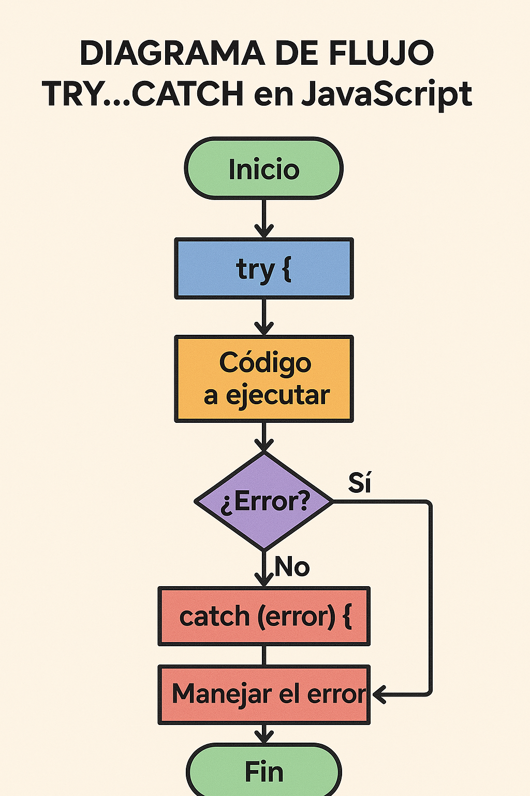
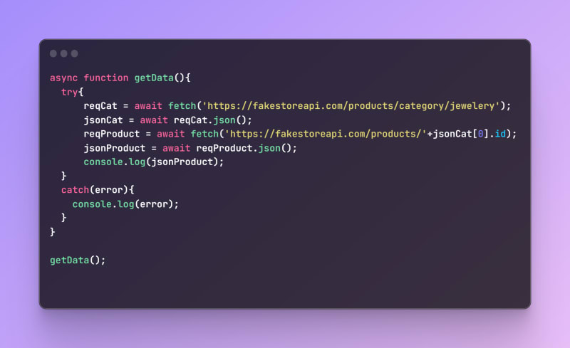
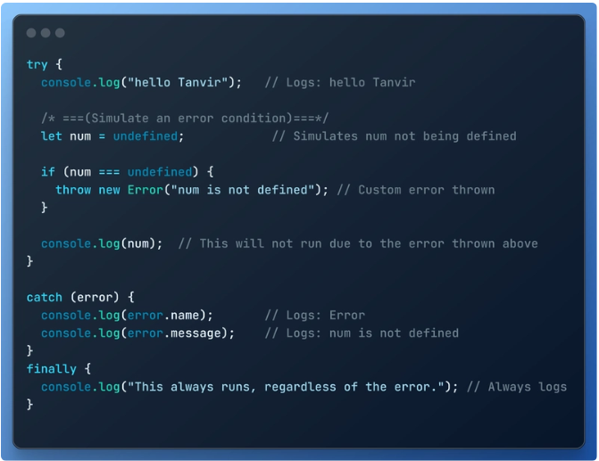
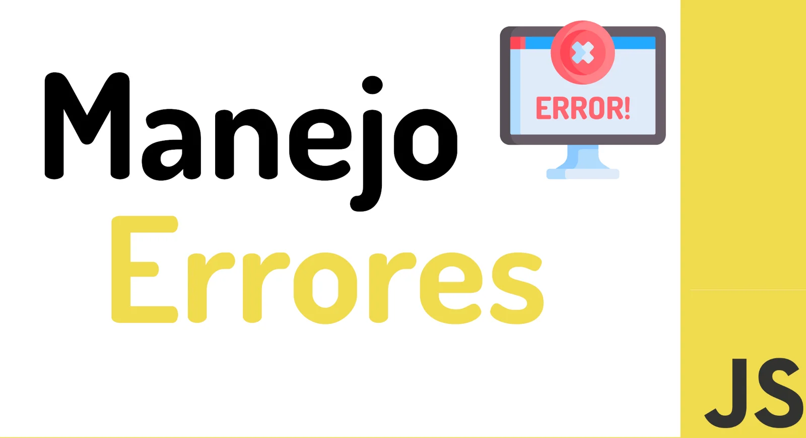
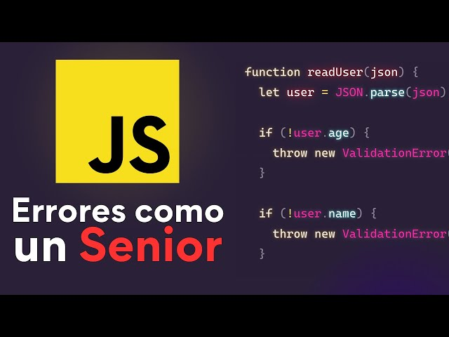

# Clase 04: Manejo de Errores en JavaScript

En esta clase aprendimos sobre el manejo de errores en JavaScript, una habilidad fundamental para escribir código robusto y evitar fallos inesperados en nuestras aplicaciones.

## Contenido de la Clase

### 1. ¿Qué es el manejo de errores?

El manejo de errores es el proceso de anticipar, detectar y responder a errores en el código. Esto permite que nuestras aplicaciones sean más estables y fáciles de depurar.

### 2. Estructuras principales para el manejo de errores

En JavaScript, las estructuras principales para manejar errores son:

- **try...catch**: Permite capturar errores en un bloque de código.
- **finally**: Se ejecuta siempre, independientemente de si hubo un error o no.
- **throw**: Permite lanzar errores personalizados.

### 3. Ejemplo práctico

En el archivo `ManejoErrores.js` se encuentra un ejemplo práctico que incluye:

- Uso de `try...catch` para capturar errores.
- Lanzamiento de errores personalizados con `throw`.
- Uso de `finally` para ejecutar código de limpieza.

### 4. Buenas prácticas

- Validar entradas antes de procesarlas.
- Lanzar errores con mensajes claros y descriptivos.
- Evitar capturar errores genéricos sin manejarlos adecuadamente.

## Recursos Visuales

A continuación, se incluyen imágenes explicativas de la carpeta `assets`:

### Diagrama de flujo del manejo de errores

### Ejemplo de código con try...catch

### Uso de throw y finally

### Imagenes visuales de ejemplos

### Recursos adicionales

- **Documentación de MDN sobre manejo de errores**: [MDN](https://developer.mozilla.org/es/docs/Web/JavaScript/Guide/Control_flow_and_error_handling)
- **Artículos sobre buenas prácticas**: [Buenas prácticas](https://example.com/buenas-practicas)

## Archivo de Referencia

El archivo `ManejoErrores.js` contiene todos los ejemplos vistos en clase. Asegúrate de revisarlo para comprender mejor los conceptos.

## Conclusión

El manejo de errores es una herramienta esencial para cualquier desarrollador. Aplicar estas técnicas te permitirá escribir código más confiable y fácil de mantener.
